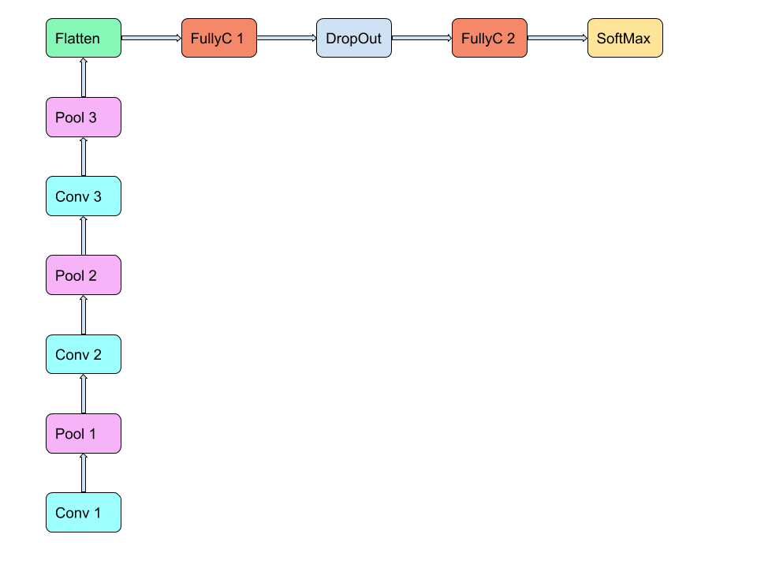

# Introduction

The aim of the following work is to create a deep neural network, precisely
a deep convolutional network, and compare its performance depending on the
variation of its hyperparameters, performing a model selection.  
The network used consists of:

- 3 Convolutional layers  
- 3 Max pooling layers  
- 2 Fully connected Layers  
- 1 Dropout layer  
- 1 Softmax layer  

# Dataset

The dataset used for this work is the OCR dataset that contains 52,152 16x8
bitmap images of handwritten characters.  

- Each example is represented as a 16x8 matrix (number of pixels), flattened.  
- The dataset is divided into:
  - Training set: 41,721 examples  
  - Test set: 10,431 examples  

The class of each image is a character among the 26 letters of the alphabet,  
converted to one-hot encoding before training.  

# The Network

The network was built using the TensorFlow Python library for classification.  
It is composed as follows:

- Convolutional layer, kernel size (5x5), depth 1, output size 32  
- 2x2 max pooling layer → shrinks image to 8x4  
- Convolutional layer, kernel size (5x5), depth 32, output size 64  
- 2x2 max pooling layer → shrinks image to 4x2  
- Convolutional layer, kernel size (5x5), depth 64, output size 128  
- 2x2 max pooling layer → shrinks image to 2x1  
- Flatten layer  
- Fully connected layer: input = 1x2x128, output = 512  
- Dropout layer  
- Fully connected layer: input = 512, output = 26  
- Final Softmax layer for classification  

_Figure 1_ shows a graphical representation of the CNN used.  

# Model Selection

For model selection, the training set was further split into training and validation subsets.  
Two hyperparameters were tested:

- Epochs: range 1 → 35  
- Learning rate: range 1e-2 → 1e-6  

The combination of hyperparameters that yielded the best accuracy and lowest loss was selected:  

- Epochs = 6  
- Learning rate = 0.001  

This configuration achieved:  

- Average accuracy = 91.7841%  
- Loss = 0.25453  

Batch sizes:  
- Training set = 128  
- Validation set = 64  
- Same batch sizes were used for the final training and test evaluation.  

# Results

After model selection, the model was trained on the entire training set and evaluated on the test set.  

Results:  

- Accuracy = 91.9854%  
- Loss = 0.25785  

The predictions of the test examples are reported in a separate text file.  

# Figure

```{r, echo=FALSE}
# Placeholder for figure (CNN architecture)
# Include the figure if available
# Example: 
